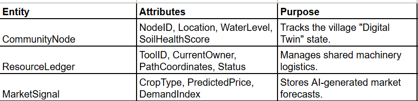

1. High-Level Architecture
Aura follows a layered architecture pattern designed for the "Edge-to-Cloud" continuum.

Data Ingestion Layer: Uses AWS IoT Core to manage LoRaWAN-connected soil sensors and Sentinel Hub API for satellite telemetry.

Intelligence Layer:

Cloud: Amazon SageMaker hosts the "Collective Crop Weaver" and heavy predictive models.

Edge: TensorFlow Lite runs on mobile devices for real-time leaf-scan diagnostics.

Communication Layer: Amazon Polly and Twilio convert AI insights into localized voice responses.

2. Database Schema Design (AWS DynamoDB) Provides insightful analysis  

The image contains more information

             

3. User Interface Design
The Symbiosis Dashboard: A React-based web app for cooperatives showing communal resource trends using D3.js visualizations.

The Aura Mobile App: A Flutter-based "companion" app featuring:

The Scanner: A camera viewfinder with an Edge AI overlay for pest detection.

The Oracle: A simple "Press-to-Talk" interface for NLP-driven queries.

The Map: A GPS-enabled view of shared machinery locations.

4. Innovation & USP Logic
Difference: Unlike individualistic apps, Aura optimizes for the community as a single organism, preventing market gluts and resource depletion.

Sustainability: It turns conservation into a profit-maximizing activity by linking soil health directly to lower input costs and higher market bargaining power.